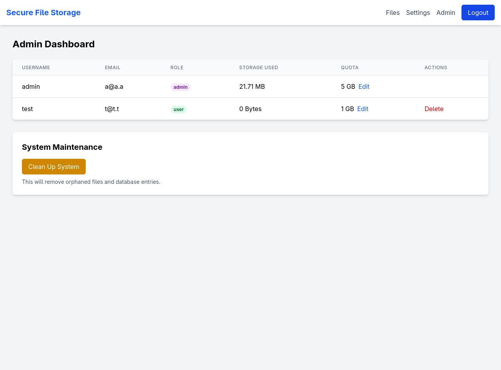
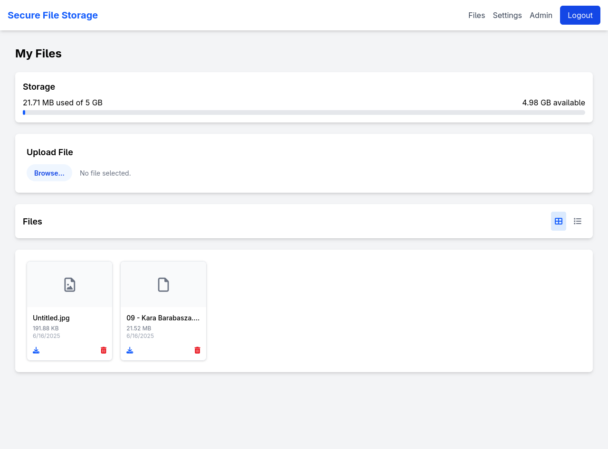
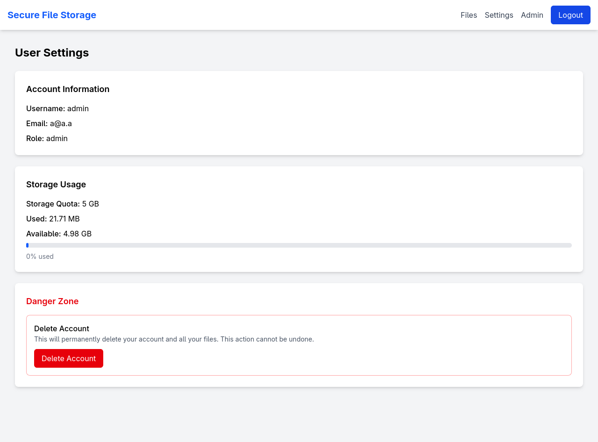

# Secure Personal Cloud

This project is a dockerized personal cloud service that allows users to securely store files with customizable storage quotas. The application is built using React for the frontend, Node.js for the API, and Keycloak for OAuth 2.0 authentication and authorization.

## Screenshots

| Admin Panel | Dashboard | Settings |
| --- | --- | --- |
|  |  |  |
| Admin panel interface for user management and system maintenance | Main dashboard showing file storage and management | User settings page for account management |


## Project Structure

```
secure-personal-cloud
├── frontend/         # React frontend application
│   ├── src/          # Frontend source code
│   └── Dockerfile    # Frontend container configuration
├── api/              # Node.js API application
│   ├── src/          # API source code
│   └── Dockerfile    # API container configuration
├── docker-compose.yml # Docker Compose configuration
├── .env              # Environment variables
└── README.md         # This file
```

## Features

- **Secure Authentication**: OAuth 2.0 with PKCE implementation using Keycloak
- **Role-Based Access Control**: Different permissions for admin and regular users
- **User Management**: Admin panel for managing users
- **Storage Management**:
  - Default 5GB storage quota per user
  - Admins can adjust storage quotas
  - Visual storage usage tracking
- **File Operations**:
  - Upload, download, and delete files
  - File listing with different view modes (grid/list)
- **System Maintenance**: Admin tools for cleaning orphaned files and database entries

## Prerequisites

- Docker
- Docker Compose

## Running the Application

1. Clone the repository:
2. Configure environment variables (optional):
3. Build and run the application:

   ```bash
   docker-compose up --build
   ```

4. Access the applications:
   - Frontend: [http://localhost:3000](http://localhost:3000)
   - API: [http://localhost:5000/api](http://localhost:5000/api)
   - Keycloak Administration Console: [http://localhost:8080/admin](http://localhost:8080/admin)

## Keycloak Configuration

After starting the containers, you need to configure Keycloak. Fortunately for you, I exported correct config (realm-export.json)

All you have to do is:
1. Create new realm
	- Instead of configuring everything by hand, upload resource file
	- Name it
2. Add users
	- admin user 
	- test user
	- Set credentials for both users
	- Set up role mapping for users:
		- admin for admin
		- user for test user

3. (Optional) Add user registration
	- Go to Realm Setings
	- Click on Login tab
	- Switch User registration

## User Interface

### Dashboard
The main dashboard displays:
- Current storage usage with visual quota indicator
- File upload functionality
- List of uploaded files with download/delete options
- Toggle between grid and list view

### User Settings
The user settings page displays:
- Account information
- Storage usage details
- Account deletion option

### Admin Panel
The admin panel (only accessible to users with admin role) provides:
- List of all users with their information
- Storage quota management for each user
- User deletion functionality
- System maintenance tools

## Security Flow

1. Frontend initialization:
   - The frontend initializes Keycloak on application startup
   - PKCE is used for secure authentication
   - Upon successful login, the user is redirected to the dashboard

2. API authentication:
   - Every API request includes the Keycloak token in the Authorization header
   - The API validates the token using Keycloak's public key
   - The API checks user roles for protected endpoints

3. Role-based access:
   - Regular users can only access their own files and information
   - Admin users can access the admin panel with user management capabilities
   - API endpoints return different data based on user roles

## Volumes and Data Persistence

The application uses Docker volumes for data persistence:
- `mongo_data`: Stores MongoDB data for API
- `postgres_data`: Stores PostgreSQL data for Keycloak
- `keycloak_data`: Stores Keycloak configuration
- `api_uploads`: Stores uploaded files

## Stopping the Application

To stop the application, press `Ctrl + C` in the terminal where Docker Compose is running. To remove the containers while preserving volumes, run:

```bash
docker-compose down
```

To completely remove all data including volumes:

```bash
docker-compose down -v
```